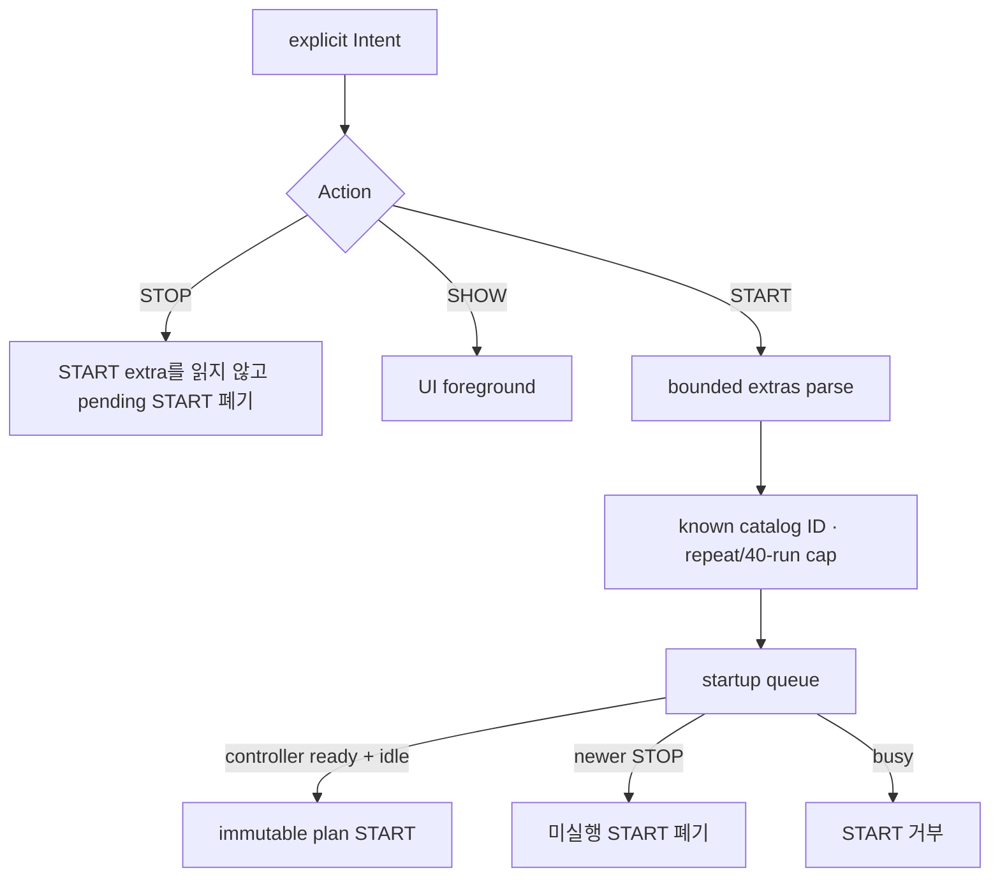

# Intent automation guide

> **Authority:** 외부 SHOW/START/STOP command의 호출 예, ordering, validation cap과 오류 의미
> **Audience:** lab harness 개발자, ADB 사용자, QA automation 담당자
> **Update when:** component/action/extra, queue ordering, cap 또는 debug/release permission이 바뀔 때
> **Does not own:** manifest/AIDL migration 전체, catalog phase 의미, UI queue 사용법
> **Related:** [Documentation index](INDEX.md), [EXTERNAL_CONTRACTS.md](EXTERNAL_CONTRACTS.md),
> [SCENARIOS.md](SCENARIOS.md), [TESTING.md](TESTING.md),
> [SYSTEM_INTEGRATION.md](SYSTEM_INTEGRATION.md)

Automation은 catalog preset plan만 제어한다. Custom scenario의 arbitrary parameter를
Intent로 주입하지 않는다.

## Wire contract와 validation

Component, action, extra 이름·타입의 stable wire authority는
[External contracts](EXTERNAL_CONTRACTS.md#automation-intent)다. 호출할 때는 항상
explicit `-n` component를 사용한다. Direct `MainActivity` START와 implicit Intent는
automation command가 아니다.

Automation parser는 catalog ID만 허용한다. Repeat는 기본 1·최대 10, expanded plan은
최대 40회다. Unknown/empty ID, 두 ID extra의 동시 사용, malformed type, overflow와
실행 중 START는 거부한다.

## ADB 예제

아래 `$component`는 대상 variant에 맞춰 정한다.

```powershell
$component = 'com.example.dpulayerlab.debug/com.example.dpulayerlab.AutomationActivity'

adb shell am start -n $component `
  -a com.example.dpulayerlab.action.SHOW

adb shell am start -n $component `
  -a com.example.dpulayerlab.action.START `
  --es scenario_id dpu-only-repeat-shock `
  --ei repeat_count 2

adb shell am start -n $component `
  -a com.example.dpulayerlab.action.START `
  --es scenario_ids 'dpu-only-repeat-shock,dpu-device-envelope-burst' `
  --ei repeat_count 2

adb shell am start -n $component `
  -a com.example.dpulayerlab.action.STOP
```

Shell별 quoting이 다르므로 ID 목록이 하나의 `scenario_ids` string으로 전달됐는지 확인한다.
Catalog ID의 현재 목록은 `ScenarioCatalog.kt`와 [Scenarios](SCENARIOS.md)가 authority다.

## Ordering과 lifecycle



- 최신 STOP은 모든 미실행 START를 폐기한다.
- 이 규칙은 STOP duplicate 제거보다 우선한다.
- STOP은 malformed START Bundle을 unparcel하지 않는다.
- Activity/backend 초기화 전 command는 bounded startup queue에만 머문다.
- Controller가 실행 중이면 START를 쌓아 나중에 실행하지 않고 거부한다.
- SHOW는 load를 시작하지 않는다.

## Security

Release alias의 stable permission/component 계약은
[External contracts](EXTERNAL_CONTRACTS.md#component와-resolution), 제품 배치와
privapp allowlist는 [System integration](SYSTEM_INTEGRATION.md#test-automation-권한)이
authority다. Debug만 lab 자동화를 위해 alias permission을 제거하며 debug 동작을 제품
security model로 간주하지 않는다. Release permission을 제거하거나 broad implicit
filter를 추가하지 않는다.

## 결과와 오류

Automation acceptance는 테스트가 성공했다는 뜻이 아니다. UI와 report에서 다음을 확인한다.

- plan source `EXTERNAL_INTENT`
- queue/repeat/current/next progress
- scenario별 verdict와 terminal reason
- exact/proxy/N/A provenance
- STOP이면 `ABORTED`와 cleanup 결과

Parser rejected message는 input 오류다. Accepted START 뒤 safety/media/provider preflight가
거부한 것은 runtime 조건 오류다.

## Harness 회귀 checklist

1. SHOW가 plan을 시작하지 않음
2. single ID와 ordered duplicate ID list
3. repeat 1/10, expanded 40 경계
4. repeat 0/11, unknown/empty/malformed/overflow 거부
5. `scenario_id`+`scenario_ids` 동시 거부
6. busy START 거부
7. STOP이 malformed START payload보다 우선
8. 최신 STOP이 pending START를 모두 폐기
9. direct MainActivity START 무시
10. implicit resolution 실패
11. release permission 보호와 debug overlay 차이

관련 unit test는 `AutomationIntentContractTest`와 `MainActivityMathTest`다.
