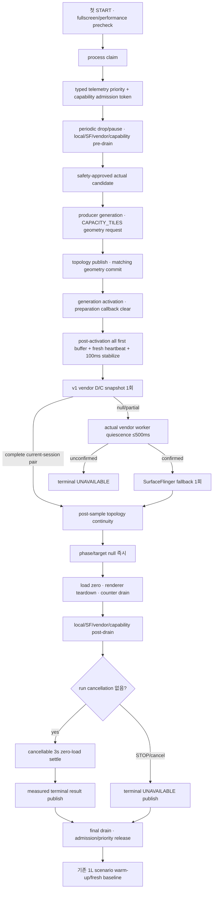

# Process-session HWC capacity calibration

> **Authority:** 최초 1회 20-layer HWC candidate 관측의 scope, 순서, 결과 의미와 재사용 계약
> **Audience:** display 시험 설계자, controller/renderer maintainer, metric reviewer
> **Update when:** calibration topology, deadline, sample source, scope, teardown 또는 UI/event 의미가 바뀔 때
> **Does not own:** 일반 typed HWC phase, 보편적 plane 수, safety hard cap, BSP provider 구현
> **Related:** [Documentation index](INDEX.md), [AGENTS.md](../AGENTS.md),
> [STATE_MACHINES.md](STATE_MACHINES.md), [METRICS.md](METRICS.md),
> [SCENARIOS.md](SCENARIOS.md), [TESTING.md](TESTING.md)

이 calibration은 scenario마다 실행하지 않는다. App process에서 최초로 승인된 START의
첫 scenario에 들어가기 직전에 정확히 한 번 시도하고, 성공·실패·취소 모두 terminal
결과로 저장한다. 이후 scenario, repeat, START와 Activity 재생성은 같은 결과를
재사용한다.

## 목적과 비목적

목적:

- system bar가 숨겨진 test Window에서 많은 opaque RGB producer를 한 번 게시
- 같은 candidate topology의 fresh `HWC APP RAW` DEVICE/CLIENT 원자 쌍과
  같은 sample의 `T=D+C` 관찰
- 뒤의 scenario가 참고할 수 있는 process-local advisory boundary 제공

비목적:

- 모든 format/scale/transform/display에 통용되는 HWC plane maximum 결정
- raw total에서 app Window root를 차감하거나 workload-only plane ceiling 추론
- ScenarioSafetyPolicy hard cap 자동 변경
- catalog의 `DEVICE_ONLY`/`CLIENT_REQUIRED` typed evidence 대체
- 반복적인 1→20 layer 탐색 또는 binary search
- logcat/sysfs/debugfs를 임의 탐색해 plane 수 추론

## 요청 topology

| 항목 | 요청 |
|---|---|
| logical/physical candidate | 20 layer / 20 independent Surface producer |
| producer pacing | 30 fps |
| display request | 60 Hz |
| backend | `INDEPENDENT_SURFACES` |
| pixel route | `RGB_8888` |
| buffer size | `DISPLAY` |
| motion | `CAPACITY_TILES` |
| destination | non-overlap crop union 1 screen-equivalent; partial final row도 full-width 재분할 |
| alpha | opaque |
| GL tail | 없음 |
| CPU/memory/generated GPU/NPU cross-load | 모두 0 |

Runtime safety와 graphics budget은 actual candidate layer 수를 20보다 줄일 수 있다.
UI/event/report는 항상 requested `20L`과 actual candidate를 별도로 표시한다.

Running HUD는 같은 Activity root에 그리는 pure Compose이고 HUD 전용
`SurfaceView`/`TextureView`/`SurfaceControl`을 만들지 않으므로 extra physical
producer와 SF/HWC surface는 0이다. 그러나 Compose HUD와 1 Hz telemetry 갱신은 app
Window root를 다시 그릴 수 있다. HUD 동적 state를 하나의 immutable snapshot으로
격리하고 app-side 최대 1 Hz로만 교체해도 이는 redraw 빈도 정책일 뿐이다. Android의
public/privileged app API로 이 root를 HWC `DEVICE`/`CLIENT` 중 하나로 강제하거나 raw
count에서 제외할 수 없으므로 calibration D/C/T는 control/root 보정 없는 미분리
app-display raw 값이다.

## Scope와 lifetime

Store:
`app/src/main/java/com/example/dpulayerlab/engine/HwcCapacityCalibrationSession.kt`

Scope key:

- physical display ID
- width/height 축 순서를 정규화한 short/long physical dimensions

단순 portrait/landscape 축 교환은 같은 scope다. Display ID 또는 normalized dimensions가
바뀌면 기존 result를 새 display에 적용하지 않고 `UNAVAILABLE` projection을 반환한다.
같은 process에서 두 번째 측정은 하지 않으며 새 측정은 process restart 뒤에만 가능하다.

Disk, SharedPreferences와 report에서 다음 process의 calibration을 복원하지 않는다.

## 실행 순서



Priority를 먼저 획득한 뒤 periodic telemetry를 drop하고 기존 worker를 drain한다.
Calibration sample은 optional vendor v2 GPU/frequency transaction을 생략한다. V1
snapshot이 원자 D/C를 제공하지 못하면 실제 vendor telemetry worker가 끝난 뒤에만
SurfaceFlinger child를 시작한다.
Capability retry/discovery admission token은 pre-drain 전에 획득하고 final post-drain
뒤에만 identity-matched release한다. 그 사이 도착한 service callback/retry는 하나의
deferred refresh로 합쳐지고 20L candidate가 내려간 뒤 Handler에 게시된다.

Topology publication과 matching geometry acknowledgment 뒤 generation을 activation하면
preparation-era first-buffer 관측은 지운다. 따라서 calibration readiness는 activation
이후 같은 committed producer set이 새로 낸 모든 first buffer와 fresh heartbeat만으로
충족한다. Producer readiness를 기다리는 구간은 100ms control cadence로 direct
thermal/power/low-memory를 확인한다. Pre-drain과 bounded composition sample 자체에는
별도의 100ms poll을 병렬로 추가하지 않으며 cancellation과 전체 deadline으로 제한한다.

## Deadline

Topology/geometry commit, generation activation, post-activation 모든 first buffer,
100ms stabilization, single calibration composition transaction과 post-sample
validation은 하나의 최대 6000ms producer-active deadline 안에서 끝나야 한다.

- readiness poll은 stabilization+snapshot completion reserve를 남기는 범위로 clamp한다.
- 100ms stabilization 전체와 snapshot reserve를 확보할 수 없으면 target을 즉시 null로
  내리고 `UNAVAILABLE`로 끝낸다.
- sample 직후 20L target을 null로 내려 validation 지연이 load를 연장하지 않게 한다.
- renderer teardown과 worker quiescence는 deadline 밖이어도 mandatory다. 3000ms
  zero-load settle은 cleanup-confirmed 정상 진행에서만 수행하는 cancellable 단계다.
- deadline을 넘으면 값이 늦게 도착해도 `OBSERVED_AT_CANDIDATE`로 수락하지 않는다.

## 수락 조건

Result를 observed로 수락하려면 다음이 모두 참이어야 한다.

1. actual candidate가 claim에 기록됨
2. expected/observed physical producer count가 candidate와 일치
3. 같은 generation의 topology가 published/ready이고 pending/missed가 아님
4. geometry requested/applied revision과 profile이 일치
5. topology/geometry commit 뒤 같은 generation을 activation함
6. activation이 preparation-era callback을 지운 뒤 모든 producer의 fresh first buffer와
   heartbeat를 다시 확인함
7. sample 전후 topology revision, publication timestamp와 discontinuity serial이 같음
8. runtime/teardown failure와 renderer cleanup pending이 없음
9. D/C가 같은 source·quality·timestamp의 완전한 fresh `APP_RAW_UNSEPARATED` pair이고
   `T`는 그 pair에서만 계산됨
10. vendor service pair이면 snapshot session이 현재 registration과 같음
11. sample/validation이 producer-active deadline 안에 완료

한 항목이라도 실패하면 0이나 추정 max가 아니라 terminal `UNAVAILABLE`이다.

## 결과 모델

| Status | 의미 |
|---|---|
| `PENDING` | 아직 process claim을 시도하지 않은 UI 상태 |
| `OBSERVED_AT_CANDIDATE` | actual candidate에서 fresh app raw D/C pair를 관측 |
| `UNAVAILABLE` | reject, timeout, STOP, source/topology/teardown 실패의 terminal 결과 |

주요 field:

- `candidateLayers`: safety-approved actual candidate 또는 producer handoff 전 실패의 null
- `observedDeviceLayers`, `observedClientLayers`
- `T`: 별도 독립 peak나 workload count가 아니라 위 두 field의 같은-sample 합
- `source`, `quality`, `evidenceMonotonicMs`
- calibration display ID와 normalized dimensions
- bounded detail

UI 예:

```text
HWC capacity · session 1회 · 요청 20L · 실제 후보 12L · HWC APP RAW D8/C4/T12 · SCOPE 미분리
```

Report event:

- `SESSION_HWC_CAPACITY_CALIBRATION`
- `SESSION_HWC_CAPACITY_REUSE_GUIDANCE`

Reuse guidance는 matching opaque RGB/crop topology의 advisory일 뿐 safety cap이 아니다.
Candidate 수나 raw `T`로 workload plane ceiling, 보편적 HWC maximum 또는 renderer hard
cap을 추론하지 않는다. Workload-only composition attribution이 제품 acceptance에
필요하면 BSP가 display/session, producer generation/revision과 exact HWC layer identity를
같은 validate/present sample에 결속한 scoped typed evidence를 제공해야 한다. 앱은
이름 문자열, `PHYSICAL` producer 수 또는 root 상수 차감으로 그 identity를 대신하지
않는다.

## Cleanup과 scenario 격리

모든 terminal path는 먼저 다음 cleanup barrier를 확인한다.

- phase와 target null
- CPU/memory/generated GPU/NPU cross-load zero
- 모든 physical producer teardown
- calibration producer frame counter drain
- generated traffic counter drain
- local SystemMonitor worker actual completion
- SurfaceFlinger lane와 dumpsys child 종료
- vendor v1/v2 executor lane completion
- vendor capability lane actual completion과 새 discovery/retry admission 차단

위 cleanup이 모두 확인되고 run이 취소되지 않은 경로만 cancellable 3초 zero-load
settle과 마지막 direct thermal/power/low-memory recheck를 수행한 뒤 scenario warm-up으로
이동한다. STOP/cancel은 mandatory cleanup을 생략하지 않지만 optional settle은 즉시
건너뛰고 process-session을 terminal `UNAVAILABLE`로 닫아 두 번째 20L burst 없이
Window/performance owner를 복구한다.

Calibration의 readiness를 첫 scenario baseline에 재사용하지 않는다. 기존 1L warm-up도
자기 generation의 topology/geometry commit → activation → preparation callback clear →
post-activation all-producer fresh first buffer를 bounded하게 확인한 뒤 baseline을
수집하고, baseline 직후 같은 readiness를 다시 검증한다.

Barrier 미확인은 telemetry lifecycle을 process-sticky failure로 만들고 후속 START를
차단한다. Calibration frame, traffic와 exact counter delta는 첫 scenario의 fresh
baseline/peak에 포함하지 않는다.

## 변경·복구 checkpoint

관련 source:

- `engine/HwcCapacityCalibrationSession.kt`
- `engine/LabController.kt`
- `monitor/SystemMonitor.kt`
- `monitor/FrameTracker.kt`
- `monitor/SurfaceFlingerProbe.kt`
- `vendor/VendorBridge.kt`
- `render/LayerStageView.kt`
- `ui/DpuLayerLabApp.kt`

관련 test:

- `HwcCapacityCalibrationSessionTest`
- `LabControllerMathTest`
- `ProducerGenerationGateTest`
- `SystemMonitorMathTest`
- `SurfaceFlingerProbeTest`
- `VendorBridgeStateTest`

최소 회귀 항목:

- process당 claim 1회와 terminal reuse
- orientation reuse/display change N/A
- requested 20과 safety-clamped actual 분리
- exact fixed topology와 zero cross-load
- vendor timeout 뒤 SF overlap 금지
- capability retry/service callback이 admission token과 pre/post drain 사이에 끼어들지 않음
- cancel 중 pre/post drain과 identity-matched priority release
- deadline 직전 poll/stabilization clamp와 STOP 시 optional settle 생략
- safety-clamped partial final row의 non-overlap full crop union
- topology/geometry commit 전 activation 거부와 activation 뒤 preparation callback 제거
- post-activation all-producer first-buffer/heartbeat 누락 시 observed 거부
- app raw D/C/T의 same-sample 원자성, control/root 무보정과 PHYSICAL producer 분리
- raw candidate/T로 workload plane ceiling을 추론하지 않음
- post-sample deadline/topology discontinuity 거부
- teardown/counter drain 뒤 첫 scenario 시작
