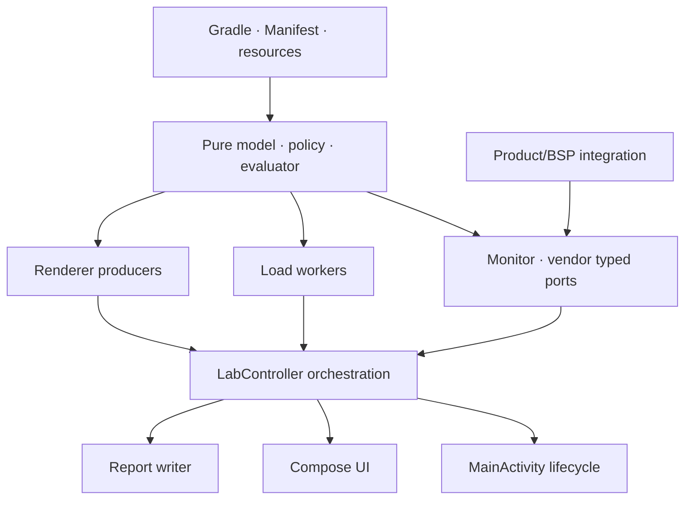

# Repository map과 변경 영향

> **Authority:** tracked file·package의 책임, dependency 방향, 변경 시 함께 확인할 영역
> **Audience:** maintainer, coding agent, reviewer, source 복구 담당자
> **Update when:** 파일 이동·추가·삭제, package 책임, build entry 또는 generated boundary가 바뀔 때
> **Does not own:** runtime 상태 전이, 요구사항 우선순위, metric/scenario의 세부 의미
> **Related:** [Documentation index](INDEX.md), [ARCHITECTURE.md](../ARCHITECTURE.md),
> [RECONSTRUCTION.md](RECONSTRUCTION.md), [STATE_MACHINES.md](STATE_MACHINES.md),
> [TESTING.md](TESTING.md)

이 문서는 source를 다시 만들거나 기능의 영향 범위를 찾을 때 사용하는 파일 지도다.
Architecture가 component 관계를 소유하고, 이 문서는 그 component가 현재 어느 tracked
파일에 있는지를 소유한다.

## 최상위 구조

```text
.
├─ AGENT.md / AGENTS.md
├─ README.md / PLAN.md / ARCHITECTURE.md / PROJECT_MEMORY.md
├─ docs/
├─ build.gradle.kts / settings.gradle.kts / gradle.properties
├─ gradle/wrapper/
├─ .idea/runConfigurations/
├─ app/
│  ├─ build.gradle.kts
│  └─ src/
│     ├─ main/
│     │  ├─ AndroidManifest.xml
│     │  ├─ aidl/
│     │  ├─ java/com/example/dpulayerlab/
│     │  └─ res/
│     ├─ debug/AndroidManifest.xml
│     └─ test/java/com/example/dpulayerlab/
└─ system_integration/
   ├─ product/
   └─ vendor/
```

## Build와 application entry

| 경로 | 책임 |
|---|---|
| `settings.gradle.kts` | repository와 `:app` module 등록 |
| `build.gradle.kts` | AGP와 Kotlin plugin version |
| `app/build.gradle.kts` | SDK, application ID, version, variant, Compose/AIDL/dependency |
| `gradle/wrapper/*` | Gradle 8.13 실행 authority |
| `.idea/runConfigurations/*` | VCS-shared Android Studio debug/release Gradle configuration |
| `app/src/main/AndroidManifest.xml` | launcher, release automation security, provider, permission |
| `app/src/debug/AndroidManifest.xml` | debug application ID의 automation permission 제거 |
| `MainActivity.kt` | Activity lifecycle, display envelope, Intent intake, controller/backend 연결 |

## Model package

`app/src/main/java/com/example/dpulayerlab/model/`은 Android resource ownership 없이 가능한
순수 계약과 evaluator를 둔다.

| 파일 | 책임 |
|---|---|
| `LabModels.kt` | enum/data class, phase/scenario/plan/progress/telemetry 공통 모델 |
| `ScenarioSafetyPolicy.kt` | hostile input validation, hard/runtime cap, graphics budget |
| `ScenarioClassifier.kt` | catalog facet와 목적 중심 분류 |
| `ScenarioQueueEditor.kt` | 순서·중복 보존 queue 편집 |
| `LoadTransitionEvaluator.kt` | phase 간 setpoint 전이와 coverage |
| `LoadShapeEvaluator.kt` | worker 내부 steady/pulse/ramp/saw profile |
| `LayerTrafficEstimator.kt` | full-buffer traffic와 destination footprint 추정 |

새 model은 가능한 한 이 package에서 순수 함수로 만들고 boundary test를 먼저 추가한다.
Android `Context`, `View`, `Binder`, codec 또는 file I/O를 model에 넣지 않는다.

## Engine package

`app/src/main/java/com/example/dpulayerlab/engine/`은 plan orchestration과 app-owned load,
report, lifecycle transaction을 소유한다.

| 파일 | 책임 |
|---|---|
| `LabController.kt` | plan/scenario/phase 실행, safety, telemetry, verdict, teardown |
| `HwcCapacityCalibrationSession.kt` | process당 최초 1회 HWC candidate claim/result 재사용 |
| `ScenarioCatalog.kt` | 안정적인 preset ID와 phase 정의 |
| `AutomationIntentContract.kt` | explicit Intent parse, cap, startup queue ordering |
| `DeviceRenderSafety.kt` | RAM/display/power-save 기반 runtime render envelope |
| `LoadGenerators.kt` | CPU/memory/NPU worker와 app-owned workload lifecycle |
| `PerformanceEnvironment.kt` | wake/performance isolation의 순수 계약 |
| `TestWindowIsolation.kt` | immersive fullscreen acknowledgment와 복원 token |
| `ReportWriter.kt` | schema v2 JSON, atomic publish, retention, share validation |
| `ActivityFreeCompletionGroup.kt` | Activity를 보유하지 않는 bounded completion barrier |
| `ControllerBackendCleanup*.kt` | Activity 재생성 사이 backend cleanup 직렬화 |

`LabController.kt`는 큰 orchestration root다. 새 계산 규칙을 이 파일의 Android 상태와
섞기 전에 순수 helper/model로 분리하고 `LabControllerMathTest` 또는 전용 test에서
경계를 고정한다.

## Render package

| 파일 | 책임 |
|---|---|
| `LayerStageView.kt` | physical Surface/Texture topology, transform/crop, producer generation |
| `StressGlSurfaceView.kt` | EGL/GLES workload와 GL producer |
| `VideoDecoderSelection.kt` | pinned descriptor, track fingerprint, codec binding |
| `MediaFormatCompat.kt` | API/format compatibility key |
| `RendererSafetyState.kt` | unconfirmed teardown와 process-wide lease/latch |

Renderer callback은 generation token과 physical producer ID를 보존해야 한다. Hot path에
per-frame lambda, boxed timestamp, unbounded allocation을 추가하지 않는다.

## Monitor와 vendor package

| 파일 | 책임 |
|---|---|
| `monitor/FrameTracker.kt` | producer heartbeat, topology readiness, frame/miss counter |
| `monitor/SystemMonitor.kt` | serialized telemetry transaction과 source 선택 |
| `monitor/SurfaceFlingerProbe.kt` | bounded dumpsys child와 parsing |
| `monitor/KernelSensorProvider.kt` | allowlisted kernel/product probe path |
| `monitor/CapabilityScanner.kt` | device capability projection |
| `vendor/VendorBridge.kt` | versioned AIDL/reflection adapter, timeout, session, cleanup |

Portable app은 임의 sysfs/debugfs 탐색을 하지 않는다. 제품별 path와 service는
[System integration](SYSTEM_INTEGRATION.md)에 정의된 typed boundary를 통과해야 한다.

## UI와 resource

| 경로 | 책임 |
|---|---|
| `ui/DpuLayerLabApp.kt` | catalog/facet/queue/run/result 화면과 HUD |
| `ui/theme/Theme.kt` | Compose theme |
| `res/drawable/ic_launcher.xml` | launcher foreground vector |
| `res/mipmap-anydpi/*` | adaptive/round icon |
| `res/values/*` | name, color, theme |
| `res/xml/file_paths.xml` | internal `files/reports`만 공유 |
| `res/xml/backup_rules.xml` | legacy backup에서 모든 app data 제외 |
| `res/xml/data_extraction_rules.xml` | cloud/device transfer에서 모든 app data 제외 |

## Util package

| 파일 | 책임 |
|---|---|
| `util/DisplayCompat.kt` | API별 display identity, physical dimensions와 mode compatibility |

## Product integration

| 경로 | 책임 |
|---|---|
| `app/src/main/aidl/.../IDpuLabVendorService.aidl` | app-side versioned vendor contract |
| `system_integration/product/Android.bp` | product source/prebuilt Soong 예시 |
| `system_integration/product/dpulayerlab_product.mk` | product package 포함 예시 |
| `system_integration/product/privapp-permissions-*.xml` | privileged permission allowlist |
| `system_integration/vendor/probe_paths.conf.example` | 명시적 read-only probe path 형식 |

Provider 구현, SELinux policy와 signing key는 이 저장소에서 생성하지 않는다.

## Test package 대응표

| 변경 영역 | 우선 확인할 suite |
|---|---|
| phase/scenario/plan model | `LabModelsTest`, `ScenarioSafetyPolicyTest`, `ScenarioPlanPolicyTest` |
| transition/load shape | `LoadTransitionEvaluatorTest`, `LoadShapeEvaluatorTest` |
| catalog/facet/queue | `ScenarioCatalogTest`, `ScenarioClassifierTest`, `ScenarioQueueEditorTest` |
| controller/calibration | `LabControllerMathTest`, `HwcCapacityCalibrationSessionTest` |
| local worker/NPU/prewarm | `LoadManager*Test`, `LoadThreadStartTest`, `LoadSafetyStateTest` |
| producer/generation/geometry | `LayerStageViewMathTest`, `ProducerGenerationGateTest`, renderer recovery tests |
| selected media/codec | `VideoDecoderSelectionTest`, codec/media tests |
| telemetry/kernel/SF | `SystemMonitor*Test`, `KernelSensorProviderTest`, `SurfaceFlingerProbeTest` |
| vendor session | `VendorBridgeStateTest` |
| automation/Activity | `AutomationIntentContractTest`, `MainActivityMathTest` |
| UI/HUD/traffic | `DpuLayerLabAppMathTest`, `LayerTrafficEstimatorTest` |
| report/version | `ReportWriterMathTest`, `AppVersionTest` |

정확한 전체 suite 목록과 gate는 [Testing](TESTING.md)이 소유한다.

## Dependency 방향



아래 방향의 역참조는 피한다.

- model → Activity/View/Binder
- renderer → Compose UI
- vendor provider → app UI state
- report writer → mutable controller ownership
- docs/plan → runtime source 생성

## 변경 영향 checklist

| 변경한 것 | 함께 확인할 것 |
|---|---|
| `PhaseSpec` field | copy/serializer/catalog/custom UI/safety/transition/report/tests |
| producer count/topology | graphics budget/traffic/frame fidelity/readiness/teardown/HUD |
| layer size/geometry | transform ACK/coverage/traffic scope/recovery/report |
| telemetry field | quality/source/graph gap/peak/report non-finite serialization |
| vendor AIDL method | API version/transaction ordering/provider/session/tests/docs |
| Intent action/extra | manifest alias/parser/queue/security/README/harness |
| report filename/schema | FileProvider/retention/share consumer/privacy |
| package/application ID | manifest/provider/permission/Soong/allowlist/automation migration |
| version/build variant | Gradle/HUD/report/release docs/asset naming |

## Generated·local 파일 경계

다음은 source commit에 포함하지 않는다.

- `app/build/`, root `build/`, `.gradle/`
- `local.properties`, local SDK/JDK absolute path
- `*.apk`, `*.aab`, signing key/certificate/keystore
- device report, capture, selected media
- temporary release staging directory와 `.part`

Tracked source에 새 파일을 추가한 뒤에는 `git status --short`, `git diff --check`,
secret/artifact scan과 [Testing](TESTING.md)의 host gate를 실행한다.
