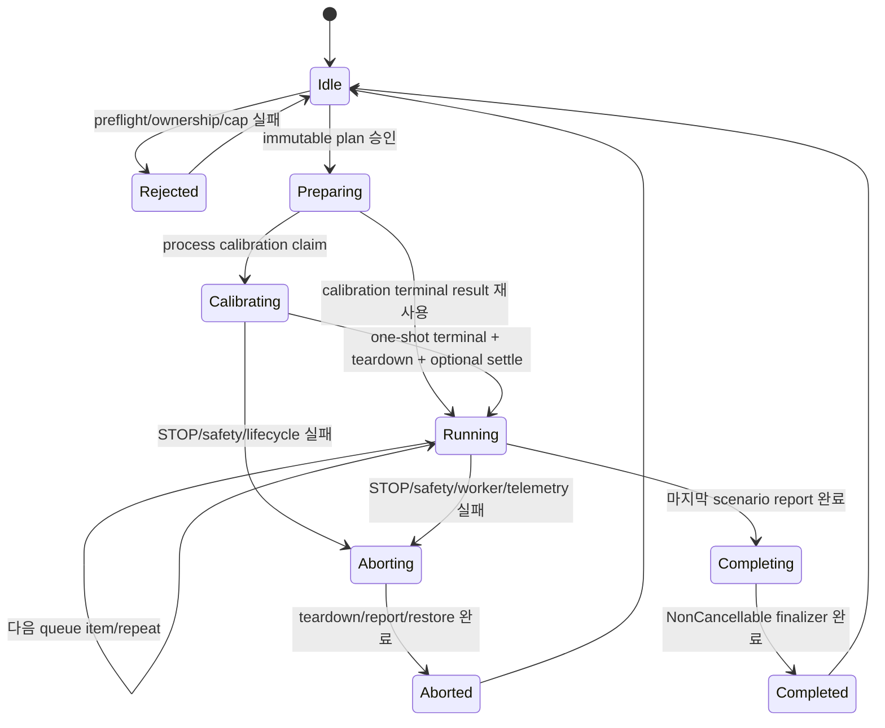
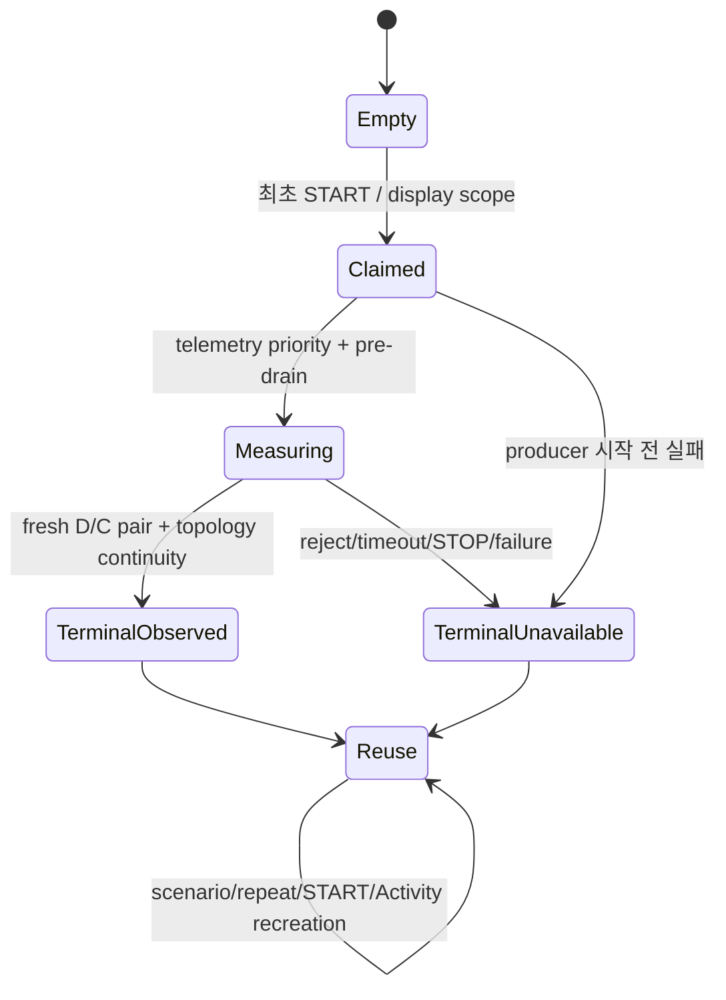
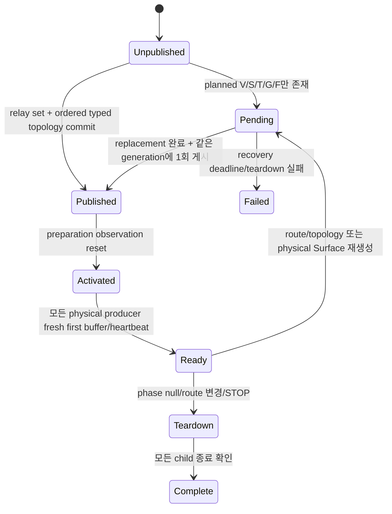
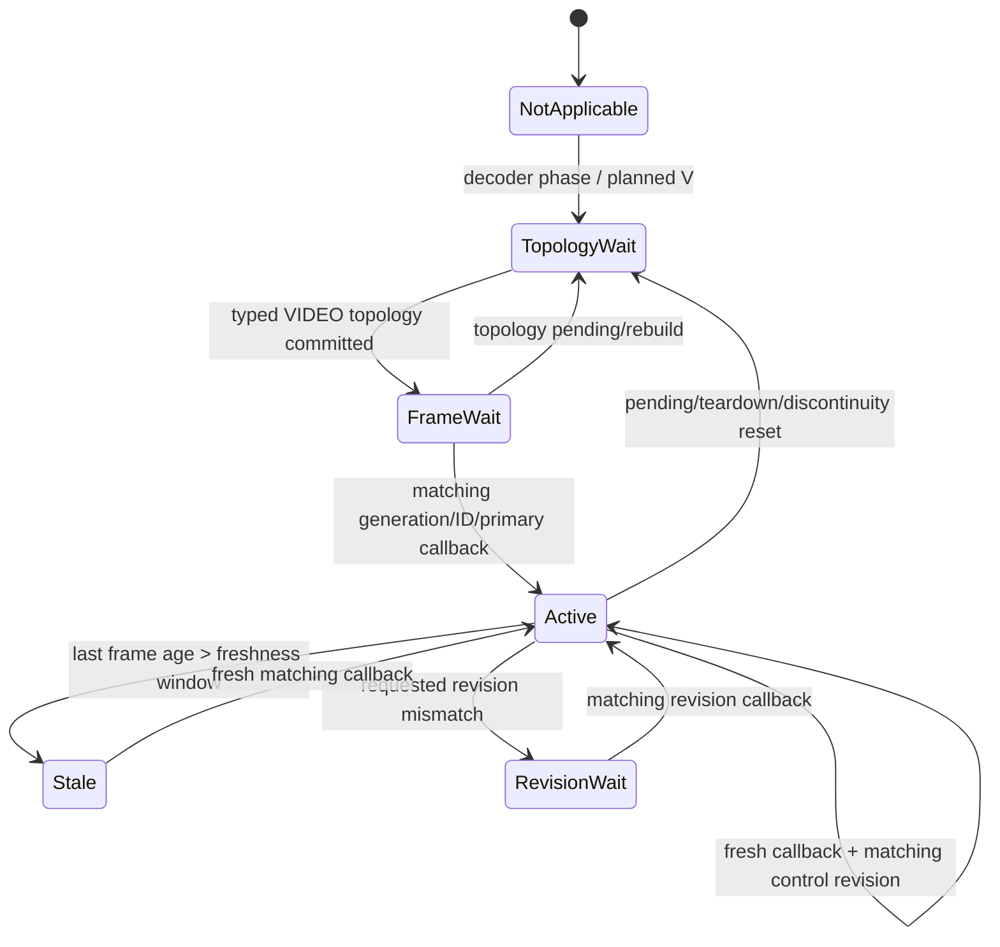
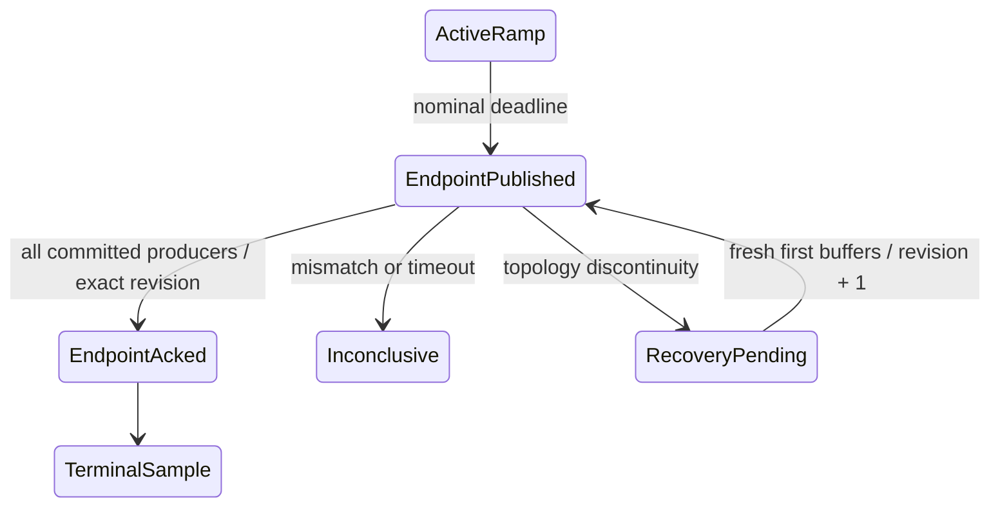
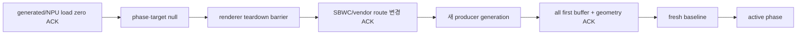
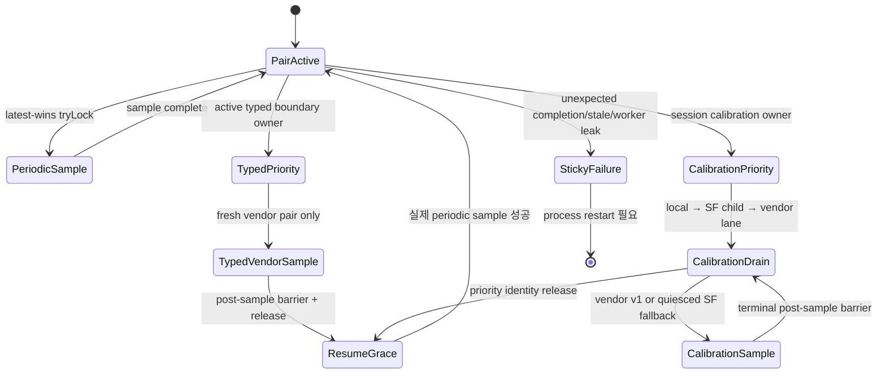
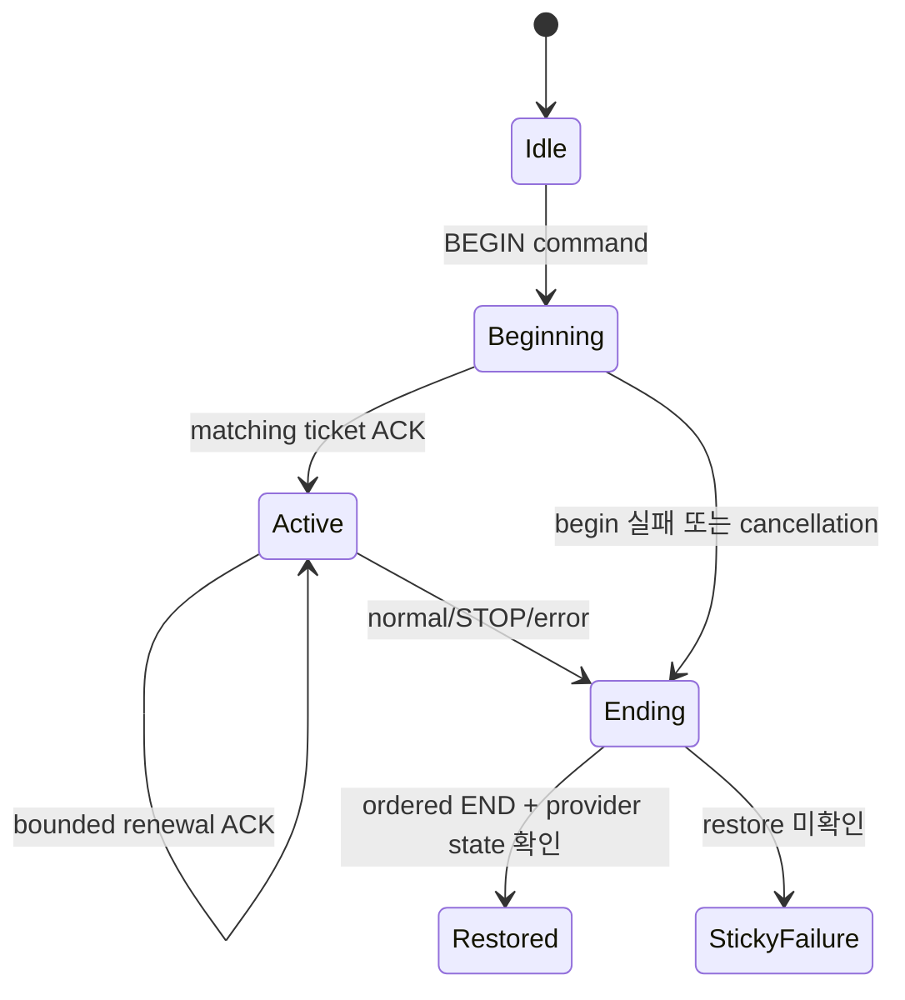

# Runtime state machines와 ownership

> **Authority:** plan, calibration, producer, telemetry, performance와 cleanup의 허용 상태 전이
> **Audience:** maintainer, concurrency reviewer, lifecycle debugger, source 복구 담당자
> **Update when:** owner token, Job/lane lifecycle, phase transaction, cancellation 또는 teardown 순서가 바뀔 때
> **Does not own:** component 파일 위치, metric 수식, scenario catalog, BSP provider 구현
> **Related:** [Documentation index](INDEX.md), [ARCHITECTURE.md](../ARCHITECTURE.md),
> [AGENTS.md](../AGENTS.md), [REPOSITORY_MAP.md](REPOSITORY_MAP.md),
> [METRICS.md](METRICS.md), [TESTING.md](TESTING.md)

이 문서는 비동기 경계의 “누가 무엇을 소유하고 언제 다음 상태로 갈 수 있는가”를
보존한다. 상세 예외와 hard cap은 [AGENTS.md](../AGENTS.md), component 설명은
[ARCHITECTURE.md](../ARCHITECTURE.md)가 authority다.

## Plan lifecycle

핵심 owner:

- `runJob`은 `CoroutineStart.LAZY`로 만들고 controller field에 먼저 게시한 뒤 시작한다.
- `runJob`이 존재하는 동안 새 START를 허용하지 않는다. `isRunning`만으로 판단하지 않는다.
- finalizer는 identity가 같은 자기 owner만 `runJob`에서 제거한다.
- queue 순서와 중복은 immutable plan snapshot에 보존한다.
- runner는 queue index를 끝까지 증가시킨 뒤에만 repeat index를 올리고 queue index 0으로
  돌아간다. 따라서 repeat는 개별 scenario 반복이 아니라 전체 queue nested loop다.
- duration multiplier는 runner 진입 전에 immutable phase/transition copy에 한 번
  materialize되며 active loop 안에서 다시 곱하지 않는다.

## Process-session HWC capacity

- Store는 process에 하나뿐이며 disk에 저장하지 않는다.
- process-session의 최초 승인된 START가 queue/repeat loop에 들어가기 전에 한 번만
  claim한다.
- 요청은 20L/30fps/60Hz이고 safety-approved actual candidate는 별도 기록한다.
- 성공·실패·취소 모두 terminal이다. 같은 process에서 두 번째 burst를 만들지 않는다.
- display ID/normalized dimensions가 바뀌면 N/A projection을 반환하고 재측정하지 않는다.
- terminal 결과를 publish하기 전에 producer/load teardown, counter drain과 worker
  quiescence를 확인한다. 3초 settle은 non-cancelled 정상 진행에서만 cancellable하게
  수행하며 STOP/cancel에서는 owner 복구를 위해 생략하고 terminal `UNAVAILABLE`을
  게시해 같은 process의 재계측을 막는다.

## Producer generation

불변식:

- expected producer는 실제 relay set commit 전에는 0(`—P`)이다.
- planned V/S/T/G/F는 outline일 뿐이며 fill은 ordered
  `producerId/layerIndex/kind/primary` topology가 같은 generation에 commit된 뒤만 허용한다.
- generation activation은 pre-activation first buffer를 지운다.
- callback은 immutable generation token과 physical producer ID를 함께 사용한다.
- topology pending/discontinuity 동안 phase clock, frame budget과 cross-load를 pause한다.
- 같은 generation의 Canvas/Texture/Video/GL BufferQueue 재생성도 geometry와 HWC/
  first-buffer evidence를 지우고 forced expected-set publication을 다시 거친다.
- teardown complete/failure의 늦은 callback은 active generation에만 귀속한다.

### Decoder frame evidence

`MediaCodec.OnFrameRenderedListener` callback은 committed descriptor의 generation,
producer ID, `VIDEO_DECODER` kind와 primary identity가 모두 맞을 때만 count한다.
Pending/teardown/rebuild는 observation count, age와 revision evidence를 지우며 새
commit과 fresh callback 전에는 이전 `Active`를 재사용하지 않는다. Generation 전체
callback count는 report용 누계로만 남고 HUD의 pending 상태에서는 active evidence처럼
표시하지 않는다.
`Active`는 app decoder frame-render evidence이지 HWC assignment나 DPU scanout
완료 상태가 아니다.

## Phase transaction

Allocation route가 유지되는 연속 setpoint 변경과 route가 바뀌는 transaction을 구분한다.

### 같은 route

1. fresh baseline과 origin producer buffer 확인
2. absolute-deadline 100ms control tick
3. FPS/Hz/workload와 허용되는 layer count 보간
4. transition coverage 기록
5. whole-phase linear이면 nominal deadline에 exact endpoint+control revision 게시
6. committed producer 전부의 matching-revision frame을 bounded hold에서 확인
7. phase-end fresh sample

Endpoint apply 직전 한 번 샘플한 시각/frame counter로 producer-fidelity 분자·분모를
같은 observed publication boundary에서 seal한다. 이후 proof hold frame은 포함하지
않는다.

### route 변경

이 순서를 우회해 이전 allocation route와 새 route를 동시에 유지하지 않는다.

## Telemetry ownership

- periodic sample은 mutex waiter를 만들지 않고 busy/priority에서 drop한다.
- active typed boundary는 SurfaceFlinger child를 만들지 않고 현재 vendor session의 fresh
  원자 D/C pair만 사용한다.
- calibration 중 watchdog pause는 success timestamp를 변경하지 않는다.
- vendor snapshot timeout 뒤 actual worker quiescence 전에는 SurfaceFlinger fallback을
  시작하지 않는다.
- source/quality 변경, reset/regress, stale sample은 continuity gap이다.

## Local workload lifecycle

각 worker는 `NEW → PREWARM/STARTING → ACTIVE → ZERO_REQUESTED → STOPPING → STOPPED`를
따른다.

- CPU/memory worker는 fixed period와 재사용 buffer를 사용한다.
- memory baseline 전 allocation/page-touch prewarm과 acknowledgment가 필요하다.
- Low-memory/drop은 memory pin 해제, drop generation, prewarm cancel을 NPU zero보다
  먼저 commit하고 worker를 깨운다. NPU adapter 예외가 memory drop을 되돌리지 않는다.
- NPU waveform과 ordered zero는 같은 versioned single-slot lane을 사용하며 latest
  command ticket/acknowledgment가 일치할 때만 applied다.
- worker exception은 first-wins process latch를 세우고 같은 process에서 clear하지 않는다.
- partial start 실패는 이미 시작된 worker를 bounded join한 뒤에만 lease를 놓는다.

## Performance isolation

Vendor API v3가 있으면 다음 lease state를 사용한다.

앱은 Battery Saver suppression만 요청한다. Thermal protection, frequency lock과 governor
override는 이 state machine에 넣지 않는다.

## Selected-media lease

1. provider open 전 process-wide refcount lease 획득
2. 5초 안 pinned seekable `AssetFileDescriptor` 획득
3. 10초 parser/metadata/codec capability 검증
4. immutable fingerprint와 concrete codec name 결속
5. renderer가 같은 descriptor에서 fingerprint 재검증
6. codec/Surface teardown 뒤 descriptor close
7. timeout/cancel worker의 실제 `finally` 뒤 refcount release

Root coroutine이 timeout돼 반환했더라도 parser worker hold가 남아 있으면 새 plan과
Activity backend 재생성을 차단한다.

## STOP과 terminal cleanup

STOP은 다음 순서를 보존한다.

1. `phase=null`, `targetPhase=null`
2. local/NPU setpoint와 display request를 안전값으로 변경
3. codec/EGL/Canvas/Surface producer teardown 확인
4. compression route를 linear/default로 reset
5. terminal fresh telemetry sample과 verdict
6. report atomic publish
7. performance policy, wake flag, immersive Window 복원
8. owner identity 확인 뒤 run/backend lease release

Low-memory abort는 memory working set을 즉시 버린다. NPU zero/close, SBWC reset,
renderer teardown 또는 performance restore가 미확인이면 process-wide sticky latch를
유지한다.

## 상태 기계 변경 checklist

- 새 상태에 최대 체류 시간 또는 cancellation 경로가 있는가?
- owner/token/generation identity 없이 늦은 callback이 상태를 바꿀 수 있는가?
- 실패를 성공/0/unavailable 중 잘못된 값으로 투영하지 않는가?
- partial start와 partial teardown 양쪽 test가 있는가?
- STOP, Activity destroy, display change, low-memory와 thermal 경계를 통과하는가?
- 새 START가 이전 finalizer보다 먼저 자원을 재획득할 수 없는가?
- 관련 `AGENTS.md`, `ARCHITECTURE.md`, test와 reconstruction checkpoint를 갱신했는가?
