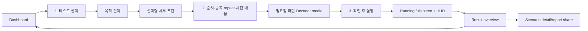

# UI information architecture와 실행 HUD 사양

> **Authority:** 화면 구조, 주요 사용자 흐름, 상태별 표시, 실행 HUD와 compact/landscape 불변식
> **Audience:** UI 개발자, 시험 UX reviewer, source 복구 담당자
> **Update when:** navigation, catalog/queue/builder/run/result 구조, HUD metric 또는 상태 표시가 바뀔 때
> **Does not own:** scenario 정의, metric 물리 의미, safety algorithm, theme 세부 색상
> **Related:** [Documentation index](INDEX.md), [README.md](../README.md),
> [REQUIREMENTS.md](REQUIREMENTS.md), [SCENARIOS.md](SCENARIOS.md),
> [METRICS.md](METRICS.md), [STATE_MACHINES.md](STATE_MACHINES.md)

UI의 목표는 시험자가 다음 네 질문에 한 화면 흐름으로 답할 수 있게 하는 것이다.

1. 무엇을 시험할 것인가?
2. 어떤 순서·전체 반복·시간 배율로 실행할 것인가?
3. 지금 실제로 무엇이 실행되고 있는가?
4. 결과와 증거 source가 무엇인가?

## Navigation

| Section | 목적 | 실행 중 노출 |
|---|---|---|
| 대시보드 | device 상태, 주요 목적 quick start, 최근 결과 | 실행 전 |
| 시나리오 | 목적/facet 필터, preset 상세, queue/repeat/time multiplier | 실행 전 |
| 커스텀 | bounded custom phase 조합 | 실행 전 |
| 시스템 | capability, permission, display/codec/sensor | 실행 전 |
| 실행 | fullscreen renderer와 HUD | active run에서 자동 전환 |
| 결과 | scenario/plan verdict와 report 공유 | terminal에서 자동 전환 |

실행 화면은 immersive이며 일반 top/bottom navigation을 숨긴다. STOP은 navigation bar가
아니라 실행 HUD header 안에 있어 compact/landscape에서도 항상 보인다.

### Test Window 격리

- status bar와 navigation bar가 모두 hidden이라는 Insets acknowledgment 전에는 physical
  producer를 시작하지 않는다.
- 시작 전 visibility mask는 token에 보존하고 STOP·실패·Activity 재생성에서도 실제
  Insets가 원래 상태로 관측될 때까지 process-wide lease를 유지한다.
- 실행 중 bar 재등장, notification shade/overlay에 따른 focus loss,
  multi-window/PiP 전환은 fail-closed 중단 사유다.
- 복원 acknowledgment가 끝나지 않으면 일반 탐색 화면처럼 표시하거나 다음 START를
  허용하지 않는다.

## 기본 흐름



Custom builder는 catalog queue와 별도의 single custom scenario를 만든다. Selected-media가
필요한 preset이 실행 queue에 있을 때만 두 번째 단계에 media card를 표시하고, SAF URI가
선택되기 전에는 시작 action을 비활성화한다.

## Dashboard

필수 정보:

- 실제 build version
- direct exact counter / privileged proxy / portable proxy mode
- AP CPU, app CPU, system memory와 available memory, producer FPS
- DPU busy+provenance, GPU busy+frequency, measured memory bus+generated traffic
- 각 metric의 quality color와 N/A 상태
- HWC DEVICE/CLIENT와 permission 상태
- `급격한 DPU 부하`, `DEVICE 후보 유지`, `CLIENT 전환 목표` 대표 preset의 명시적
  `즉시 1회 실행`
- 최근 result

Metric value가 unavailable이면 0 대신 N/A를 표시한다.

## Catalog

Catalog는 한 개의 긴 설정 form 대신 `테스트 선택`과 `순서·반복·시간` 두 단계로 나눈다.
상단 step control로 되돌아갈 수 있고, 선택 단계 하단에는 queue 수·repeat·요청 예상 시간을
보이는 고정 dock을 유지한다. Catalog의 step, filter, 펼침 상태와 각 단계 scroll은
탭 왕복과 configuration 재생성 뒤에도 보존한다. `순서·반복·시간` 단계의 Android Back은
Activity를 닫지 않고 먼저 `테스트 선택` 단계로 돌아간다.

### 목적 중심 선택

상단 quick card:

- 급격한 DPU 부하
- DEVICE 후보 유지
- CLIENT 전환 목표

각 목적은 한 줄 설명과 일치하는 preset 수만 기본 표시한다. 상세 evidence 설명은
scenario 상세와 결과에 두어 첫 화면의 기술 용어를 줄인다. 목적 선택은 filter만
변경하며 queue append/replace action은 아래의 단일 일괄 선택 card에만 둔다.

### Facet

같은 행의 선택은 OR, 서로 다른 행은 AND다.

- category
- transition/change pattern
- expected intensity
- workload
- condition/format
- composition target

Filtered result는 catalog 원래 순서를 유지한다. 일괄 `queue 교체`와 `뒤에 추가`는
한 위치에서만 제공한다. Scenario card는 이름·설명·부하 패턴·최대 layer/Hz·강도·크기와
선택 action을 기본 표시하고 phase/tag/검증 evidence는 명시적으로 펼쳤을 때만 표시한다.

### Queue와 loop

- 항목 순서와 duplicate를 보존
- 항목별 remove와 explicit move
- 기본 세로 preview는 앞 4개만 표시하고, 전체 편집기는 화면 높이에 비례한 bounded
  내부 scroll과 목록 위 `큐 접기` action을 사용
- 이동/삭제 action의 접근성 이름에 scenario 이름과 occurrence 번호 포함
- position action은 render 시 queue snapshot과 event 시 최신 queue가 다르면 적용하지
  않아 연속 입력이 다른 occurrence를 수정하지 않음
- catalog 순서로 reset
- repeat count와 expanded run 수. `N`회는 전체 queue를 N번 실행하고 `N > 1`인 회차
  경계에서만 마지막 항목 다음에 첫 항목으로 돌아간다. 1회는 전체 queue 한 번이다.
- 앱 UI는 40-entry × 10 loop = 400 run, 외부 Intent는 기존 40 run
- 1×/2×/5×/10×/50×/100× phase/transition 시간 배율
- policy 적용 전 요청 예상 duration과 phase 10분/scenario 30분 safety cap 안내
- unknown restored ID 자동 제거
- queue가 비면 숨은 repeat를 항상 1로 canonicalize

실행 전 preview는 접을 수 있으며 input change, composition target, verification을
요약한다. Queue mutation, repeat/시간 선택과 START는 event 시점의 최신 state를 다시 읽어
빠른 연속 입력이 이전 snapshot을 덮어쓰거나 제거한 scenario를 실행하지 않게 한다.

## Custom builder

Custom UI는 hard cap 안에서 다음을 구성한다.

- layer 수, producer FPS, requested Hz
- backend, pixel route, Display/1K/2K/4K/8K buffer size
- FIT/1:1 crop projection, 고정 0°/90° orientation, motion과 layer size profile
- alpha/GL
- CPU/memory/GPU/NPU setpoint와 shape
- transition mode/duration/cycle/step/duty/floor

`CAPACITY_TILES`는 internal calibration용 motion이므로 일반 custom selector에서 제외한다.
1:1 crop을 고르면 `FULL_SCREEN`과 non-scaling motion만 남기고, FIT은 motion 전
aspect-preserving base projection임을 설명한다.
Selected-media가 필요한 route는 media와 codec preflight 없이 실행하지 않는다.

## Running screen

### Layout

```text
┌────────────────────────────────────────────┐
│ Scenario · QUEUE x/y · LOOP x/y · TIME n× │
│ Buffer·FIT/crop·0°/90° · BUILD    [STOP]   │
│ Plan / phase progress                       │
│ PHYSICAL observed/expected + committed graph │
│ LOGICAL requested/active count (별도 label)  │
│ DPU     value + graph + source/quality      │
│ CPU     value + graph + source/quality      │
│ GPU     value + graph + source/quality      │
│ DPU-read / producer-write traffic           │
└────────────────────────────────────────────┘

┌────────────────────────────────────────────┐
│ transition · current→target · next phase    │
│ safety/performance/calibration status       │
└────────────────────────────────────────────┘
```

HUD는 display cutout inset을 적용하고 좌측 상단에 둔다. Renderer 전체 화면을 차지하지만
HUD는 control layer로 남으며 report의 `controlLayerIncluded=true`와 일치한다.

### 필수 live metric

| Metric | 값 | Graph |
|---|---|---|
| PHYSICAL | observed/expected physical producer; committed expected가 없으면 `—P` | committed expected 최근 60 sample; pending은 null gap |
| LOGICAL | requested/active logical layer를 `LOGICAL nL`로 별도 표시 | PHYSICAL graph에 사용하지 않음 |
| DPU | busy % 또는 N/A | provenance segment별 gap |
| CPU | AP CPU % 또는 N/A | provenance segment별 gap |
| GPU | busy % 또는 N/A | provenance segment별 gap |

각 metric은 source/quality label을 숨기지 않는다. Gauge provenance가 바뀌거나 unavailable인
경계에서 graph 선을 연결하지 않는다.

Producer count 표기:

- `observed/—P`: topology expected set 미게시
- `observed/expected P`: committed expected set 게시
- pending/process lease에서는 expected를 0으로 투영
- `PHYSICAL` 현재 값과 history는 양수인 committed expected count만 사용한다. 따라서
  `FLATTENED_TEXTURE`의 logical N-layer는 `1P`이고 pending sample은 이전 값으로 채우지
  않는다.

### Traffic

- DPU read와 producer write를 별도 표시
- frame bytes와 GB/s/Gbps를 구분
- RGB B/px, decoder descriptor와 full source buffer 기반
- destination screen-equivalent 합계와 producer당 평균 footprint
- `CAPACITY_TILES`는 crop union 1 screen-equivalent
- SBWC compression ratio를 추정값에 적용하지 않음
- measured bus utilization과 합치지 않음

### Progress와 상태

- queue/repeat/current/next scenario
- 선택한 duration multiplier와 effective phase elapsed/duration
- phase index, elapsed/duration
- current→target layer/FPS/size/workload
- transition mode/segment/fraction
- next phase/scenario
- safety clamp/thermal derate/memory low
- performance isolation
- process-session HWC calibration requested/actual/result
- HWC expectation은 `RAW MATCH`, `RAW WAIT`, `RAW N/A` 보조 표시

RAW 상태는 controller의 distinct-sample/coverage verdict를 대체하지 않는다.

### Compact/landscape

- STOP은 header에서 제거하지 않음
- LAYERS/DPU/CPU/GPU를 2-column compact layout으로 유지
- detail panel은 bounded height와 vertical scroll
- plan/phase progress를 한 줄로 압축
- metric source/quality를 생략하지 않음
- renderer와 HUD가 status/navigation bar inset을 다시 만들지 않음

## Result

Plan overview:

- completed/total, clean/suspected/inconclusive/aborted count
- repeat/queue/run index
- scenario별 verdict와 terminal reason

Scenario detail:

- exact underrun delta/source/quality
- suspected proxy delta
- peak CPU/memory/generated traffic
- stable-source peak DPU/GPU/bus/produced FPS
- peak HWC DEVICE/CLIENT와 provenance
- sample 수
- report path/share

Exact evidence가 없으면 proxy를 exact로 승격하지 않는다. Result color만으로 verdict를
전달하지 않고 label과 terminal reason을 함께 표시한다.

## System

- runtime protection policy
- DUMP/vendor/NPU/SBWC capability
- display modes
- codec capability
- direct sensor label/source/value
- product integration 안내
- vendor broker permanent typed failure reason(config/grant/signer/service contract)

Unavailable 기능에 “활성” toggle을 제공하지 않는다.

## Empty/error/loading

| 상태 | 표시 |
|---|---|
| telemetry 아직 없음 | value N/A + source unavailable |
| catalog filter 0건 | filter summary와 reset action |
| queue 비어 있음 | 실행 disabled + 추가 안내 |
| media 필요/미선택 | requirement와 선택 action |
| plan rejected | 현재 화면 유지 + snackbar/terminal reason |
| Battery Saver active | `설정 열기`; cleanup/원상복구와 Window restore 뒤 전용 Saver 설정, 처리 불가 시 일반 설정. Background에서는 pending 요청을 보존하고 defer/launch 실패 시 action 재제공 |
| topology pending | `—P`, phase clock 시작 전 준비 상태 |
| cleanup sticky | process restart 필요 reason |
| report 없음 | share disabled |

이전 result가 있을 때 새 START가 reject됐다고 old result와 rejected plan metadata를
합치지 않는다.

## 접근성·사용성 checklist

- STOP과 주요 action에 text label 유지
- color 외에 label/icon/text로 상태 구분
- 작은 화면에서 중요한 control이 scroll 밖으로 사라지지 않음
- 긴 scenario/source/error text는 ellipsis 또는 scroll
- 숫자에 unit 포함
- N/A, pending, proxy, exact 표현을 일관되게 사용
- destructive/reset action과 run action을 시각적으로 구분
- 목적/개별 선택 → 순서·반복·시간 → run → result의 두 단계 설정 흐름
- queue 이동/삭제는 기호만 쓰지 않고 text label과 occurrence 기반 TalkBack 설명 제공
- 두 step control은 button 색뿐 아니라 tab role과 selected semantics를 제공
- 선택 화면의 고정 dock은 실제 측정 높이로 bottom padding을 갱신해 큰 글꼴에서도 마지막
  scenario를 가리지 않음

## UI 회귀 test

관련 source:
`app/src/main/java/com/example/dpulayerlab/ui/DpuLayerLabApp.kt`

관련 suite:

- `DpuLayerLabAppMathTest`
- `RendererContainerRememberOwnerTest`
- `LayerTrafficEstimatorTest`
- `ScenarioClassifierTest`
- `ScenarioQueueEditorTest`
- `MainActivityMathTest`
- `TestWindowIsolationTest`
- `AppVersionTest`

변경 뒤 compact/landscape STOP, graph provenance gap, `—P`, requested/actual calibration,
queue duplicate/order, 선택/plan별 scroll·filter 복원, 연속 add/repeat 입력,
시간 배율 복원, Battery Saver 설정 이동의 cleanup defer/fallback, Window hide/restore
acknowledgment와 result-old-state 분리를 반드시 재검토한다.
